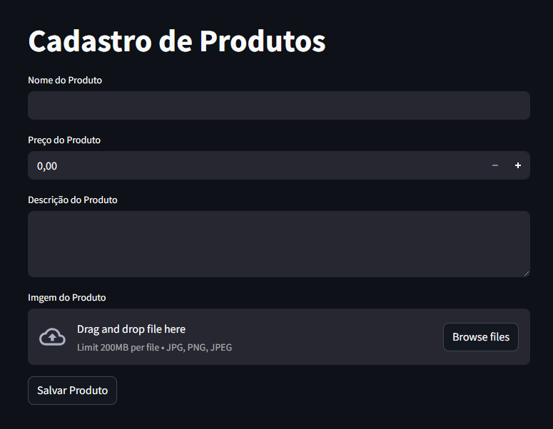
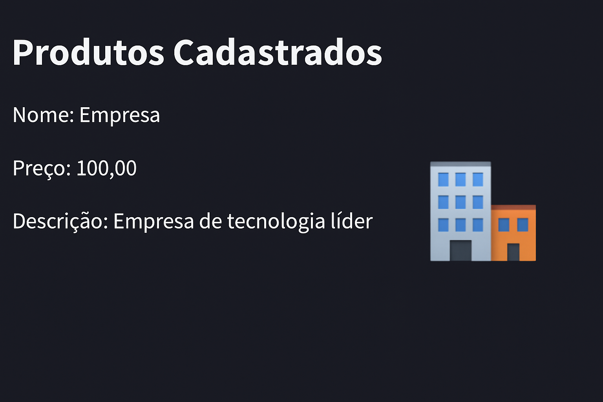

Claro, aqui está a versão atualizada do seu `README.md`, incorporando a nova pasta `LPContainerApps` com a explicação do projeto de Container Apps no Azure:

---

### 🛒 Cadastro de Produtos com Streamlit e Azure

Este repositório contém dois projetos distintos que demonstram o uso de tecnologias da **plataforma Microsoft Azure**:

1. **Cadastro de Produtos com Streamlit e Azure**
2. **LPContainerApps – Aplicação Web com Azure Container Apps**

---

## 📦 Projeto 1 – Cadastro de Produtos com Streamlit e Azure

Este projeto foi desenvolvido como parte do desafio prático da plataforma DIO para aplicar conhecimentos em **Azure Storage Blob**, **SQL Server** e **Streamlit**.

### 💡 Descrição

A aplicação permite o cadastro de produtos com nome, preço, descrição e imagem, armazenando imagens no **Azure Blob Storage** e os dados em um banco **SQL Server** hospedado na nuvem.

#### Funcionalidades

- Upload de imagem para o Azure Blob
- Inserção de dados no banco SQL Server (via `pymssql`)
- Interface web com Streamlit
- Listagem dos produtos cadastrados com exibição da imagem

### 📸 Prints

#### Tela de Cadastro


#### Tela de Listagem


### 🔧 Tecnologias Utilizadas

- [Python 3.x](https://www.python.org/)
- [Streamlit](https://streamlit.io/)
- [Azure Blob Storage](https://learn.microsoft.com/en-us/azure/storage/blobs/)
- [pymssql](http://www.pymssql.org/)
- [dotenv](https://pypi.org/project/python-dotenv/)

### 🚀 Como Rodar

```bash
git clone https://github.com/seu-usuario/seu-repositorio.git
cd seu-repositorio
pip install -r requirements.txt
```

Crie um arquivo `.env` com as seguintes variáveis:

```
BLOB_CONNECTION_STRING=
BLOB_CONTAINER_NAME=
BLOB_ACCOUNT_NAME=
SQL_SERVER=
SQL_DATABASE=
SQL_USER=
SQL_PASSWORD=
```

Execute com:

```bash
streamlit run app.py
```

---

## 📦 Projeto 2 – LPContainerApps: Aplicação no Azure Container Apps

Este diretório contém um projeto que demonstra a criação e publicação de uma aplicação containerizada utilizando **Azure Container Apps**.

### 📁 Estrutura da Pasta

```
LPContainerApps/
├── html/
│   └── index.html          # Página principal da aplicação
├── Dockerfile              # Dockerfile para criação da imagem
├── deploy.ps1              # Script de criação da infraestrutura no Azure
├── build-and-push.ps1      # Script para build e push da imagem para o ACR
```

### ⚙️ Descrição

O projeto mostra como:

- Criar uma imagem Docker a partir de um `index.html`
- Publicar a imagem em um Azure Container Registry (ACR)
- Criar e expor um **Container App** via script PowerShell
- Automatizar o processo de build, push e deploy

### 🔧 Requisitos

- Docker instalado
- Azure CLI configurado e logado
- Permissões para criar recursos no Azure (ACR, RG, Container App)


### 🧠 Aprendizados

- Criação de containers personalizados com Docker
- Publicação em Azure Container Apps via linha de comando
- Deploy automatizado com PowerShell

---

### 📌 Projeto Original DIO

Este projeto é uma versão personalizada do desafio prático fornecido pela DIO:  
🔗 [Repositório Base Microsoft Application Platform](https://github.com/digitalinnovationone/Microsoft_Application_Platform)

---
