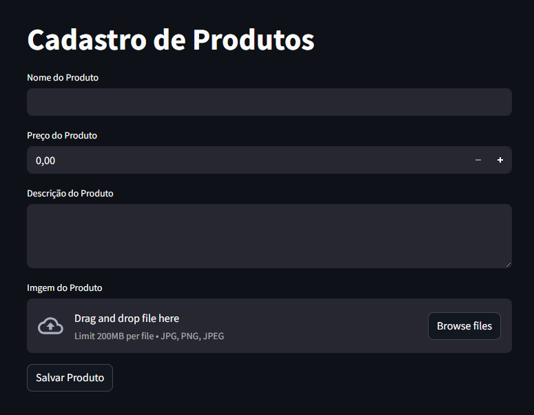
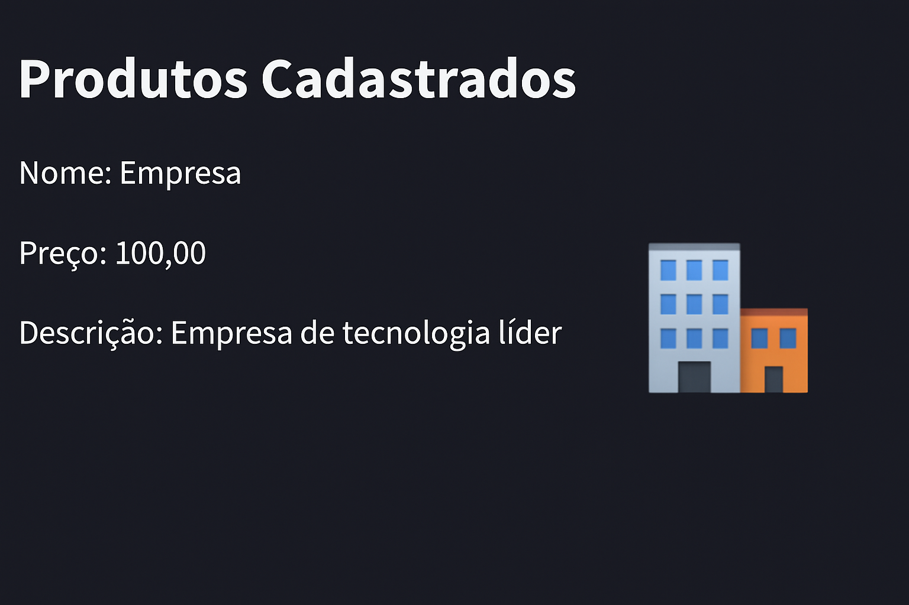

### 🛒 Cadastro de Produtos com Streamlit e Azure

Este projeto foi desenvolvido como parte do desafio prático da plataforma DIO para aplicar conhecimentos em **plataformas de aplicação Microsoft**, utilizando **Azure Storage Blob**, **SQL Server** e **Streamlit** para criação de uma interface web.

### 💡 Descrição do Projeto

A aplicação permite o cadastro de produtos com nome, preço, descrição e imagem, que é armazenada no **Azure Blob Storage**. Os dados são inseridos em uma tabela no banco de dados SQL Server hospedado na nuvem.

Funcionalidades:

- Upload de imagem para o Azure Blob
- Inserção de dados no banco SQL Server (via pymssql)
- Interface interativa com Streamlit
- Listagem dos produtos cadastrados com exibição da imagem

### 📸 Prints da Aplicação

### Tela de Cadastro


### Tela de Listagem



### 🔧 Tecnologias Utilizadas

- [Python 3.x](https://www.python.org/)
- [Streamlit](https://streamlit.io/)
- [Azure Blob Storage](https://learn.microsoft.com/en-us/azure/storage/blobs/)
- [pymssql](http://www.pymssql.org/)
- [dotenv](https://pypi.org/project/python-dotenv/)

### 📦 Instalação


```bash
git clone https://github.com/seu-usuario/seu-repositorio.git
cd seu-repositorio
pip install -r requirements.txt
```

Crie um arquivo `.env` com as seguintes variáveis:

```
BLOB_CONNECTION_STRING=
BLOB_CONTAINER_NAME=
BLOB_ACCOUNT_NAME=
SQL_SERVER=
SQL_DATABASE=
SQL_USER=
SQL_PASSWORD=
```

Inicie o Streamlit:

```bash
streamlit run app.py
```

### 🧠 Aprendizados e Insights

Durante o projeto, aprofundei os conhecimentos em:

- Conexão segura com serviços do Azure usando variáveis de ambiente
- Manipulação de arquivos binários (imagem) no Streamlit
- Integração entre serviços de nuvem (Blob Storage + SQL Server)
- Criação de interfaces simples e intuitivas com Streamlit

### 🚀 Possibilidades Futuras

- Autenticação de usuários
- Filtros por categoria/preço
- Dashboard de estatísticas com gráficos
- Publicação em nuvem via Azure Web App

### 📌 Projeto Original DIO

Este projeto é uma versão personalizada do desafio prático fornecido pela DIO:  
🔗 [Repositório Base Microsoft Application Platform](https://github.com/digitalinnovationone/Microsoft_Application_Platform)

---


